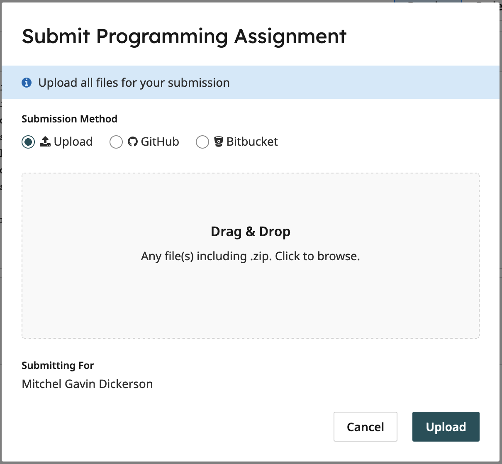

# ICS 45C: Homework 1

Welcome to ICS 45C Homework 1! For more general instructions, please reference the `main` branch.
This repository will focus on instructions relevant to HW1. In this assignment, you will be modifying:

```bash
convert_knots.h
convert_knots.cpp

stack.h
stack.cpp

letter_count.h
letter_count.cpp

# If using GTest:
knot_gtests.cpp
stack_gtests.cpp
count_gtests.cpp
```

To add this branch to your private repository, follow the instructions under the
[Getting Started](#getting-started) section.

### TLDR Build And Run:

```bash
# Pull updates:
git fetch public

# Checkout hw1:
git checkout hw1

# Push to origin:
git push -u origin hw1

# Run CMake defaults and Build Generator commands
cmake --preset default

# Target Build Command
cmake --build build   # Will build all of the `targets` described in the `CMake` file

# Build only convert_knots.cpp:
cmake --build build --target knot

# Build only Knot tests:
cmake --build build --target knot_gtests

# Build only stack.cpp:
cmake --build build --target stack

# Build only Stack tests:
cmake --build build --target stack_gtests

# Build only letter_count.cpp:
cmake --build build --target count

# Build only the Letter Count tests:
cmake --build build --target count_gtests

./build/knot          # Runs the 'main' function from src/convert_knots.cpp
./build/stack         # Runs the 'main' function from src/stack.cpp
./build/count         # Runs the 'main' function from src/letter_count.cpp
./build/knot_gtests   # Runs the 'knot' gtest set of tests
./build/stack_gtests  # Runs the 'Stack' gtests
./build/count_gtests  # Runs the 'Letter Count' gtests
```

## Getting Started

If you are using `GitHub`, then it is likely you will have already cloned this repository!
If you have not, or removed the folder for any reason, then you will need to clone your
private repository first:

```bash
# Clone your private repository
git clone <YourPrivateRepositorySSHLink>

# Change Directory into your project folder
cd <PrivateProjectName>
```

Next, you will need to pull any changes and updates, so we are going to run a `fetch` command:

```bash
# Check that you have the `public` remote setup (it should list an `origin` and a `public`):
git remote -v

# If you do not find a `public` option on the above command, you will need to add it:
git remote add public https://github.com/mgdickerson/CS45C_Spring_2023.git

# Once you are sure that you have the remote tracking set up, you can run the fetch command:
git fetch public
```

If you have set up the `remote` repository `public` to track this GitHub project, then you
should now see that `git` has pulled all the necessary changes!

### Checkout

Next, we will checkout the `hw1` branch. In the same terminal as before, you will type:

```bash
git checkout hw1
```

WARNING: It is possible that you already have a copy of the `hw1` branch for any reason. The easiest
way to update to the new instructions is to delete your private repositories' copy of the branch and
then re-checkout `hw1` and follow the rest of the instructions. (So if you see the, `multiple (2) remote
tracking branches` error, this is likely what is happening to you):

```bash
# WARNING: The following commands will delete ALL changes you have made to the hw1 branch. If you have
# important work saved there, be sure to copy it outside of the folder first!
cd ../
mkdir SavedWork
cp <PrivateRepo>/src/* SavedWork/. (This will copy all files in the src folder)

# Delete the hw1 branch locally
git branch -D hw1

# Delete the hw1 branch on your private repository on GitHub
git push origin -d hw1

# After deleting your outdated copy of the hw1 branch, run the checkout command again:
git checkout hw1
```

NOTE: If you are very confident in `git`, you can also simply merge the changes, but there will be
merge conflicts on the `CMakeLists.txt` file, so proceed with caution.

You are now in the `hw1` branch! Now, we will want to add this branch to your private repository
on `GitHub` and add tracking. To do this, we will run the command:

```bash
# Add the `hw1` branch to your private repository on GitHub
git push -u origin hw1
```

The branch will now appear in your private repository on `GitHub.com`! This also sets up the
branch to track with your private repository instead of the public one, so now simple push commands
should send changes to the correct repository:

```bash
# Push changes to private repository
git push
```

NOTE: AFTER you have done all the steps above, if you then clone this repository to a new folder or
computer, it will now have multiple references to each `branch`. It is possible that when you run the
`checkout` command, you will get an error such as: `multiple (2) remote tracking branches`. This happens
because `git` is not sure which repository to pull it from, `origin` or `public`, so we will tell it
which one to pull from, and set it to always prefer `origin` for this `branch`:

```bash
# Set the hw1 branch to track from "origin" (origin is your private repository)
git checkout --track origin/hw1
```

This will checkout the `hw1` branch and set the preference for `origin`.
You can now make changes to your code as shown in the [Coding](#coding)
section below!

## Directory Structure

If you are not using `GitHub`, and want to use our testing framework, you will need to make a folder
named `hw1` with the following structure:

```bash
├── CMakeLists.txt
├── CMakePresets.json
├── gtest
│   ├── gtestmain.cpp
│   ├── count_gtests.cpp
│   ├── knot_gtests.cpp
│   └── stack_gtests.cpp
└── src
    ├── convert_knots.cpp
    ├── convert_knots.h
    ├── letter_count.cpp
    ├── letter_count.h
    ├── stack.cpp
    └── stack.h
```

You should copy everything from the `CMakeLists.txt` and `CMakePresets.json` files into your own,
as well as the files `gtestmain.cpp` and the individual `gtests`. This will allow you to build and run the
tests for this assignment. If you do not follow this structure, you will not be able to use the
`CMakeLists.txt` file as provided!

## Coding

Starting from `hw1`, the details of the assignment itself will be covered in the homework documents
not on this `GitHub` page. For reference and example, we will include instructions for making your
`convert_knots.h` file to show how to test with either `GTest`. All further instructions on the assignment
objectives should be obtained from the related `hw` document.

### Convert Knots

For the knots converter, you can modify (or create) the file `src/convert_knots.h` using either
`vim` or `neovim` (it does not matter which you use, both will work).

```bash
vim src/convert_knots.h

# Or neovim:
nvim src/convert_knots.h
```

Once you are in `vim`/`nvim`, you will enter `insert` mode by pressing `i`. Now, you will need to add a
function named `knots_to_miles_per_minute` that takes an `integer` named `knots` and returns a `double`
value for `miles per minute`:

```cpp
double knots_to_miles_per_minute(int knots) {
  // Write your code here:
}
```

For actually converting, you will need to write code to convert the input of `knots` to
`miles per minute`. To do this, you can use the following conversions:

- 1 knot = 6076 feet per hour
- 1 mile per hour = 5280 feet per hour
- 1 hour = 60 minutes

When you have finished making your conversion function, you will need to leave `insert` mode by pressing
the `Esc` key, and then `write` and `quit` using either `:wq` or `:x` and pressing `Enter`
(NOTE : If you just want to write changes without quitting, you can use just `:w`).
Now that you have written a converter, you need to test it!

#### Knots GTest:

To add a test, you will need to modify the file `gtest/knot_gtests.cpp`:

```bash
vim gtest/knot_gtests.cpp

# Or Neovim
nvim gtest/knot_gtests.cpp
```

The file should already contain the following:

```cpp
// ------------------------- Tests File - knot_test.cpp --------------------- //
// This file is for writing your own user tests. Be sure to include your *.h
// files to be able to access the functions that you wrote for unit testing.
// An example has been provided, but more documentation is available here:
// https://github.com/google/googletest/blob/main/docs/primer.md
// -------------------------------------------------------------------------- //

// Include all of your *.h files you want to unit test:
#include "convert_knots.h"

#include <gtest/gtest.h>

namespace {

TEST(ConvertKnots, Two) {
  EXPECT_NEAR(0.0383593, knots_to_miles_per_minute(2), 0.01);
}

// ADD YOUR TESTS HERE:


} // anonymous namespace
```

As you can see in the file, it contains your `conver_knots.h` file you just made, and has
a test for comparing the output of the `knots_to_miles_per_minute` for input `2` with the
output `0.0383593`. If the conversion has been written correctly, that test should succeed,
but just to be sure, lets add another test. This time, we want to test that our output for
`3` is correct. We will add our test just below where it says `// ADD YOUR TEST HERE:`:

```cpp
TEST(ConvertKnots, Three) {
  EXPECT_NEAR(0.057539, knots_to_miles_per_minute(3), 0.01);
}
```

This will add a test to the `ConvertKnots` set named `Three` and test that the values of
your function and the number provided are equal. Now that we have written our tests, we will
want to build it and test that everything works!

## Build Instructions

If you are not already in a terminal (or ssh with OpenLab) from the above instructions, you will need
to open a terminal and move into your project folder as show below:

```bash
cd <YourProjectPath>    # So if we had the project in a folder named Projects: cd Projects/CS45C-Template
```

This time, we are going to go into a little more detail on how `CMake` works. The `CMake` process is
basically comprised of two steps: producing project build files and actually building the project.
To produce the build files for our project we run the first command:

```bash
# Build Generator Command
cmake --preset deafult # Create a folder named `build` and run `CMake` to produce build files there
```

This command needs to be run only once! Even if you change `CMakeLists.txt` or add new files, you will only
need to run the `cmake --build build` command, and it will automatically regenerate the build files for you.
Once you have the `build` folder and files, you will want to build the actual program. This can be done two ways.
You can either build everything at once:

```bash
# Target Build Command
cmake --build build   # Will build all of the `targets` described in the `CMake` file
```

Or you can pick a specific target to build. For this homework, there are 6 possible `targets`:
`knot` (which is the `convert_knots.cpp` file), `knot_gtests` (`knot_gtests.cpp`), `stack` (`stack.cpp`)
`stack_gtests` (`stack_gtests.cpp`), `count` (`letter_count.cpp`), and `count_gtests` (`letter_count.cpp`).
These `targets` are defined in the `CMakeLists.txt` file as `project(<name> CXX)`, so if you want to find
the `targets` yourself, you can always check that file. We will also always give you the available `targets`
in this class. Below are the individual `target` commands you can run:

```bash
# Build only convert_knots.cpp:
cmake --build build --target knot

# Build only Knot tests:
cmake --build build --target knot_gtests

# Build only stack.cpp:
cmake --build build --target stack

# Build only Stack tests:
cmake --build build --target stack_gtests

# Build only letter_count.cpp:
cmake --build build --target count

# Build only the Letter Count tests:
cmake --build build --target count_gtests
```

NOTE: If you build all targets with the `cmake --build build` command, you DO NOT need to
run the individual commands. The advantage of running the individual build commands is
being able to build only the parts you want to test. Also, unlike the Build Generator 
Command (`cmake --preset default`), you will need to run the Target Build Command 
(`cmake --build build <--target target>`) every time you make changes to your `*.cpp` or `*.h`
files. For example, if you build `knot_gtests.cpp`, and find out that your conversion does
not work for numbers above `10`, you will need to change `convert_knots.h`. Once you have
changed it, when you want to test it again, you can run:

```bash
cmake --build build --target knot_gtests
```

And it will build just that code with your updated changes! Very handy for testing one task
at a time.

After you have built your intended target, you will have three new executables you can run!
You will have `hw` which will be the code from `main.cpp`, `knot_gtests`, and `stack_gtests`.
You can run each one with the commands shown below:

```bash
./build/knot          # Runs the 'main' function from src/convert_knots.cpp
./build/stack         # Runs the 'main' function from src/stack.cpp
./build/count         # Runs the 'main' function from src/letter_count.cpp
./build/knot_gtests   # Runs the 'knot' gtest set of tests
./build/stack_gtests  # Runs the 'Stack' gtests
./build/count_gtests  # Runs the 'Letter Count' gtests
```

Once you have run the code above and it either produces the output you expected or passes
all provided tests, congratulations! You are now ready to [submit](#submission) your homework!

## Submission

All submissions will be done through [Gradescope](https://www.gradescope.com/). Open the Gradescope page
and select `HW1`. Now if you are using a `GitHub` account, follow the [GitHub Submission](#github-submission)
instructions, otherwise follow the [File Submission](#file-submission) instructions.

### GitHub Submission

First, we need to make sure that we commit all of our changes we made! In a terminal inside your project folder,
run the following command:

```bash
git commit -a -m "Submission commit of HW1."
```

Now that we have committed out changes, we need to push them to `GitHub` so that `Gradescope` can see them.

```bash
git push
```

Now on Gradescope, press the submit button, choose the `GitHub` option, and select your project and branch
as shown below:


Now the autograder will run and give you a score!

### File Submission

On `Gradescope`, press the `submit` button and it will bring up the following window:



Then you will drag and drop the `convert_knots.h`, `convert_knots.cpp`, `letter_count.h`,
`letter_count.cpp`, `stack.h`, and `stack.cpp` files from your `src` folder
(or wherever you have made this file) and press upload. As these are the only files we are changing (for the homework,
not for testing), they should be the only files that you upload!
