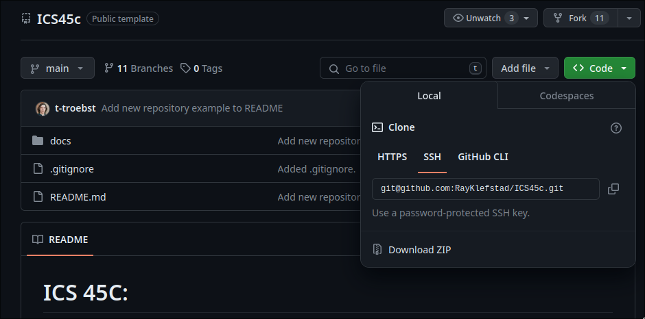
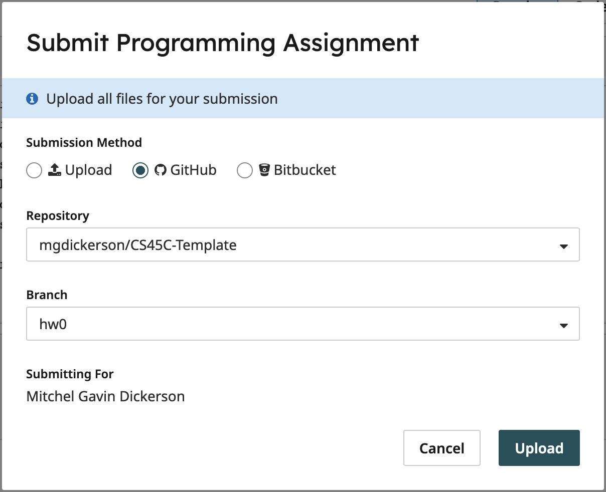

# ICS 46: Homework 0

Welcome to ICS 46 Homework 0! For more general instructions, please reference the `main` branch.
This repository will focus on instructions relevant to HW0. In this assignment, you will be modifying:

```bash
main.cpp
```

## Getting Started

If you are using `GitHub`, then getting started is easy! You will clone this repository, then
checkout the `hw0` branch! If you have already `cloned` this project, then you can skip to
the [Checkout](#checkout) instructions. If you plan to not use `GitHub` and still want to use
our provided tests, follow the instructions under [Directory Structure](#directory-structure).
If you want to manually make the individual files and not use our tests, then you can simply
make a `main.cpp` file and skip ahead to the [Coding](#coding) section.

### Clone

On `Linux` and `Mac`, you can open a new terminal. On Windows you will open `Git BASH` which
should have been installed following the instructions under the `main` branch. On OpenLab,
you are already in a terminal! Next, you will want to copy the repository link as shown in
the image below:



And then in the terminal, type:

```bash
git clone <LinkCopiedAbove>  # For example: git clone git@github.com:klefstad/CS46-Template.git 
```

There should now be a folder named `CS46-Template`. We will move into that directory using the
command:

```bash
cd CS46-Template
```

Once inside the directory, we will `checkout` the `hw0` branch!

### Checkout

In the same terminal as before, you will type:

```bash
git checkout hw0
```

You are now in the `hw0` branch! You can now make changes to your code as shown in the [Coding](#coding)
section below!

## Directory Structure

If you are not using `GitHub`, and want to use our testing framework, you will need to make a folder
named `hw0` with the following structure:

```bash
├── CMakeLists.txt
├── CMakePresets.txt
├── gtest
│   ├── gtestmain.cpp
│   └── hw_gtests.cpp
└── src
    └── main.cpp
```

You should copy everything from the CMakeLists.txt and CMakePresets files into your own, as well as
the files `gtestmain.cpp` and `hw_gtests.cpp`. This will allow you to build and run the tests for this
assignment. If you do not follow this structure, you will not be able to use the `CMakeLists.txt`
file as provided!

## Coding

We will run the text editor `vim` (or `neovim` if you prefer) on the file `src/main.cpp`:

```bash
# To use vim, type this command:
vim src/main.cpp

# To use neovim, type this command:
nvim src/main.cpp
```

Once you are in `vim`/`nvim`, you will enter `insert` mode by pressing `i`. Then type the following program
and press `Esc` when you are done.

```cpp
#include <iostream>
using namespace std;
int main() {
  cout << "Hello World!" << endl;
  return 0;
}
```

Ensure that you have left `insert` mode by pressing `Esc`, then `write` and `quit` `vim` by typing either
`:wq` or `:x`. This should close `vim`/`nvim` with your changes made. Now, you can move on to
[Build Instructions](#build_instructions)!

## Build Instructions

If you are not already in a terminal (or ssh with OpenLab) from the above instructions, you will need
to open a terminal and move into your project folder as show below:

```bash
cd <YourProjectPath>    # So if we had the project in a folder named Projects: cd Projects/CS46-Template
```

Once you are in the project folder, use the following commands to build your project:

```bash
cmake --preset default  # Create a folder named `build` and run `CMake` to produce build files there
cmake --build build     # Will build all of the `targets` described in the `CMake` file
```

This will produce a folder named `build`, which will have two new executables you can run! First, we will
run your code you just wrote:

```bash
./build/hw              # Runs the `main` function from src/main.cpp
```

This should output the following message to your terminal:

```bash
Hello World!
```

Next, we will run `GTest`. This will run tests on your code and is also how we will be grading your assignments.
If you are not on OpenLab or have not installed `GTest` on your computer you are testing on, then skip this step
and move on to [Submission](#submission).

```bash
./build/hw_gtests      # Runs the tests you wrote in `gtest/hw_gtests.cpp`
```

This should output:

```bash
[==========] Running 1 tests from 1 test suites.
[----------] Global test environment set-up.
[----------] 1 test from Hello
[ RUN      ] Hello.World
[       OK ] Hello.World (0 ms)
[----------] 1 test from Hello (0 ms total)

[----------] Global test environment tear-down
[==========] 1 tests from 1 test suites ran. (0 ms total)
[  PASSED  ] 1 tests.
```

Congratulations! You are now ready to [submit](#submission) your homework!

## Submission

All submissions will be done through [Gradescope](https://www.gradescope.com/). Open the Gradescope page
and select `HW0`. Now if you are using a `GitHub` account, follow the [GitHub Submission](#github-submission)
instructions, otherwise follow the [File Submission](#file-submission) instructions.

### GitHub Submission

First, we need to make sure that we commit all of our changes we made! In a terminal inside your project folder,
run the following command:

```bash
git commit -a -m "Submission commit of HW0."
```

Now that we have committed out changes, we need to push them to `GitHub` so that `Gradescope` can see them.

```bash
git push
```

Now on Gradescope, press the submit button, choose the `GitHub` option, and select your project and branch
as shown below:



Now the autograder will run and give you a score!

### File Submission

On `Gradescope`, press the `submit` button and it will bring up the following window:


Then you will drag and drop the `main.cpp` file from your `src` folder (or wherever you have made this
file) and press upload. As this is the only file we are changing, it should be the only file that you upload!
