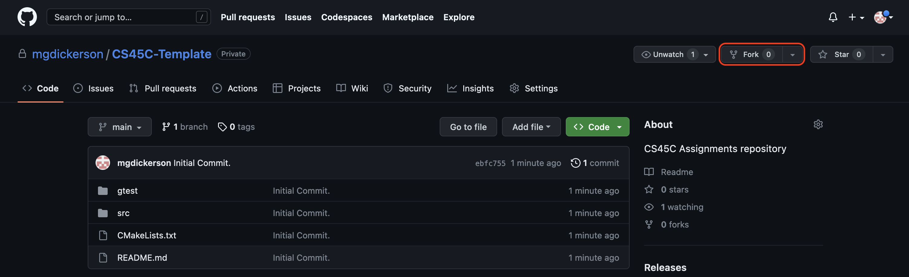
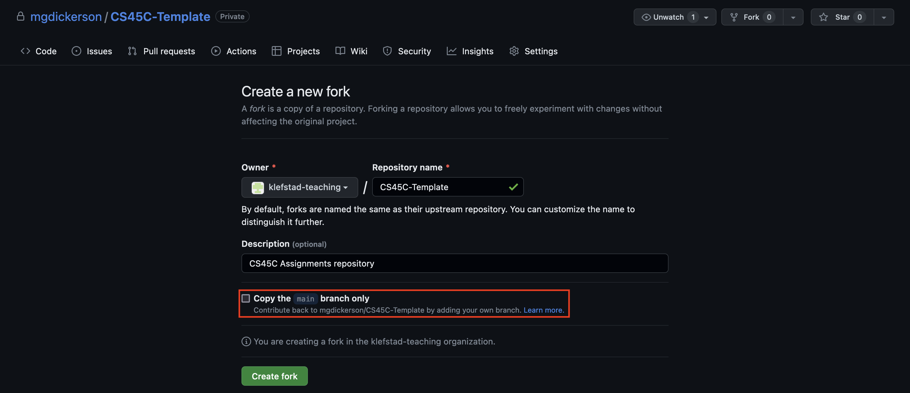

# ICS 45C: Spring 2023

Welcome to ICS 45C! This GitHub project will contain all of the project setup material you need for this
class. This `main` branch will explain all the instructions you need to copy this code to your computer
(or OpenLab), how modify the files you need to for the assignment, how to build/test your code, and
finally how to submit! If you want any further in depth instructions on any of the more advanced topics
such as `CMake`, there will be a branch with more information that you can take a look at!

NOTE : Each `branch` will have more specific instructions for each homework. This is a general
set of instructions that apply to all assignments. If you want specific instructions, select
the branch for the homework you are working on above.


NOTE : Several instructions will use `<YourVersionHere>`, which means to replace it with your
version of the item described between the `<>`. For example, `<YourNameHere>` could be replaced
with `RayKlefstad`.

## Getting Started

To get started, we will either need to make a [GitHub account](https://docs.github.com/en/get-started/signing-up-for-github/signing-up-for-a-new-github-account)
(You can use the free account as it will provide all the tools you need) and then follow the instructions
in the [GitHub](#github) section, or you will need to follow the instructions in the [Manual](#manual)
section.

Once you have a `GitHub` account, follow the instructions under the [GitHub](#github) section! If you choose
not to use `GitHub`, skip to the [Manual](#manual) section.

## Directory Structure

```bash
├── .git
├── .gitignore
├── CMakeLists.txt
├── README.md
├── gtest
│   ├── gtestmain.cpp
│   └── tests.cpp
└── src
    └── main.cpp
```

All assignments for 45C: Spring 2023 should follow the directory structure as shown above and in
this template directory. The easiest way to ensure that your project has the correct structure is
to fork this repository and to use it for writing your code. Instructions for doing this are found
in the [GitHub section below](#github). Each homework will include all of the files you will need
to complete the assignment, so you SHOULD NOT add any additional files. (If you are confident in
your `CMake` abilities, you may add more files to the `src` and `gtest` folder only, as the files
will be `Globbed` by the autograder)

## GitHub

GitHub is an online storage service for the tool `git`. `git` is used for saving changes to your
code and allows multiple people to make changes to the same code base and keep track of all the
different changes made at once. It also allows you to make multiple versions (or branches) so that
you can try out different approaches or changes without breaking what you were working on before.

To get started, you will need to make sure that you have `git` installed on the computer or system
you are working on (if you are working on OpenLab, it is already installed). To install `git` on
your computer, follow the instructions [here](https://git-scm.com/book/en/v2/Getting-Started-Installing-Git).

Once you have `git` installed, we will want to set up our basic configuration for it. On `Linux` and
`Mac` (OpenLab is Linux), you can simply open a terminal, and on `Windows` you will open the `Git BASH`
terminal you installed in the previous step. Once inside the terminal, you will be adding your
`username` and your `email`.

```bash
git config --global user.name "<YourNameHere>"    # Example: "Ray Klefstad"
git config --global user.email "<YourEmailHere>"  # Example: "klefstad@uci.edu"
```

We will also set up an `ssh` key as `GitHub` is moving away from allowing the usage of `https`
links. Please first take a look at [this page](https://docs.github.com/en/authentication/connecting-to-github-with-ssh/generating-a-new-ssh-key-and-adding-it-to-the-ssh-agent#generating-a-new-ssh-key)
which explains how to make an `ssh` key and then either follow the instructions there (it will
have instructions for Linux, Mac, and Windows). After you create your key, you will need to add
it to `GitHub`, you can do that by following 
[these instructions](https://docs.github.com/en/authentication/connecting-to-github-with-ssh/adding-a-new-ssh-key-to-your-github-account).

Once you have set up your `username`, `email`, and `ssh key`, you will need to
[fork](https://docs.github.com/en/get-started/quickstart/fork-a-repo#forking-a-repository) this
repository. To fork the repository, you will clink the `fork` button at the top right of the `GitHub`
page highlighted below:



This will bring up another page which will allow you to select your personal `GitHub` account that
you created and make your own copy of this repository. NOTE: It is very important that you make sure
the checkbox for `Copy the main branch only` is NOT selected. We want to make a copy of ALL the
branches!



After forking the repository, you will need to [clone](https://docs.github.com/en/get-started/quickstart/fork-a-repo#cloning-your-forked-repository)
the repository. On `Mac` and `Linux`, you can clone a repository by opening your `terminal` application
using `git clone` and copy-pasting the URL you got from the green `Code` button above. Example below:


And then in the terminal, type:

```bash
git clone git@github.com:<YourUserName>/<YourProjectName>.git
```

This will add a folder to wherever you are currently working with the same name as `<YourProjectName>`.
Now, to work in a specific homework, you will need to `checkout` the branch of the homework number you
are working on. For example, if you want to work on `Homework 0`, you will `checkout` the branch `hw0`
in the terminal as shown below:

```bash
git checkout hw0
```

We are now in the `hw0` branch! You can now make changes to the files in the `src` folder!
All changes for each homework should be made in the branch with the name of the homework in question.
When you submit your homework, you will be selecting that branch. For instructions on making changes,
check out the course's instructions for using `vim`/`neovim`. After making changes to the files, we will want to `commit`
those changes. `Committing` a change adds it to the history of changes and allows `git` to track it.

```bash
# The -a option means to commit all pending changes
# The -m option means to include a message
git commit -a -m "Committing changes to file x."
```

Now you have set all of your changes on your computer's `copy` of the project. In order for this copy
to be accessible online at `GitHub`, you will need to `push` your changes. This will copy your current
project changes into the online storage at `GitHub` and make it visible and copyable by anyone you are
working with.

```bash
git push
```

If the version of code on `GitHub` is more up to date than yours, you can instead `pull` the code. This
will copy any changes made to the code to your local copy on your computer:

```bash
git pull
```

## Manual

WARNING: This section is only for students that choose not to make a `GitHub` account. If you choose not
to make a `GitHub` account and follow the `git` instructions, you have two options. You can either copy
the overall directory structure in the section [Directory Structure](#directory-structure) minus the `.git`,
`.gitignore`, and `README.md` files to have the option of local building and testing, or you can make
just the files that are needed for the specific homework assignment and submit those to `Gradescope`.
Both methods will be shown below with the example of `HW0`.

### Files Only

If you only want to make and modify individual files, then you will need to make a folder somewhere on your
computer (or OpenLab) with the name of the homework you are working on, and then make each file that the
assignment requires. This will change from assignment to assignment, so here we will show an example for
homework 0, but you will need to refer to the `hw<#>` branch for  specific instructions for that assignment.

```bash
# First we will make the homework 0 directory (folder):
mkdir hw0

# Move into the hw0 directory:
cd hw0

# Make the files we will need (touch creates a file if the file does not already exist):
touch main.cpp
```

Now you have all the files you need to work on Homework 0, and can modify the files as needed to complete
the assignment. For more instructions on that, please reference the `hw0` branch. Once you have modified
the files as you see fit, skip ahead to the [File Submission](#file-submission) section. 

### Folder Structure

If you decide to copy the entire folder structure, then you will need to create the folders as shown in
[Directory Structure](#directory-structure). The files required in the project will change depending on
the assignment, so refer to the `hw<#>` branch for specific files you will need to make and copy. It is
incredibly important that you copy the contents for the `CMakeLists.txt` file and `gtest/` folder
accurately as this will determine the ability of the [Build Instructions](#build-instructions) to work
correctly. Once you have copied the folder structure and files correctly, you can make the changes to
the `main.cpp` file as required for the `hw0` assignment and then move on the to the
[Build Instructions](#build-instructions) to test that you have made everything correctly.

## Build Instructions

To build and run your program, you will need to open a terminal and move into the folder with your
project in it. For example:

```bash
cd <YourProjectName>    # So if we had the project in a folder named Projects: cd Projects/CS45C-Template
```

Once you are in the project folder, use the following commands to build and then run your project:

```bash
cmake -B build        # Create a folder named `build` and run `CMake` to produce build files there
cmake --build build   # Will build all of the `targets` described in the `CMake` file

# The build folder will now contain two executable files that you can run:
./build/hw            # Runs the `main` function from src/main.cpp
./build/gtest         # Runs the tests you wrote in `gtest/tests.cpp`
```

You should never need to modify the `CMakeLists.txt` file, but if you are interested, you can reference
the [CMake](#cmake) the section below. For more information
on [GTest](#gtest), either check the section below or reference the [primer](https://google.github.io/googletest/primer.html).
GTest will only build if you have it installed on your system. If you do not want to install it
on your computer, you can use the OpenLab computers as it is installed there.

The general instructions end here! You can now either switch to the branch for the homework you plan to
work on for instructions specific to that homework, or if you are interested in some extra information
you can check out the following sections for [CMake](#cmake) and [GTest](#gtest). Understanding those
sections are not required for this class but may be interesting if you want to more about C++ build systems
and testing.

## Submission

All submissions will be done through [Gradescope](https://www.gradescope.com/). Open the Gradescope page
and select `HW0`. Now if you are using a `GitHub` account, follow the [GitHub Submission](#github-submission)
instructions, otherwise follow the [File Submission](#file-submission) instructions.

### GitHub Submission

First, we need to make sure that we commit all of our changes we made! In a terminal inside your project folder,
run the following command:

```bash
git commit -a -m "Submission commit of HW0."
```

Now that we have committed out changes, we need to push them to `GitHub` so that `Gradescope` can see them.

```bash
git push
```

Now on Gradescope, press the upload button, choose the `GitHub` option, and select your project and branch
as shown below:


Now the autograder will run and give you a score!

### File Submission

On `Gradescope`, press the `upload` button and it will bring up the following window:


You will then drag and drop only the files you have changed for that assignment. For example, in homework 0
you will be changing the `main.cpp` file, so you would drag and drop that file. Then press the upload button!

## CMake

CMake is an industry standard for building C/C++ projects, and is used for making managing and building
large code bases manageable. Learning about CMake is likely to be useful to you if you ever work with
C/C++ code. For this class, we will keep the CMakeLists.txt file as simple as possible, but you will be
required to make minor changes to it. These changes will be required whenever we add new `.cpp` files
to the project. We will add a file named `addtwo.cpp` to implement the functions described in `addtwo.h`.

```bash
touch src/addtwo.h    # Adds the .h file
touch src/addtwo.cpp  # Adds the .cpp file
```

Our two files we add are shown below:
```c
#ifndef ADDTWO_H
#define ADDTWO_H

int addtwo(int a);

#endif // ADDTWO_H
```

```cpp
#include "addtwo.h"

int addtwo(int a) {
  return a + 2;
}
```

Now that we have added our new header and `.cpp` file, we will need to let `CMake` know. We will add
our `.cpp` file to the `set(SRC_FILES_EXCEPT_MAIN)` function in the CMakeLists.txt file.
Our resulting CMakeLists.txt file should contain:

```cmake
set(SRC_FILES_EXCEPT_MAIN
  src/example.cpp
  src/addtwo.cpp
)
```

We do not need to add the `addtwo.h` file as it is already referenced by `addtwo.cpp` and will be
added by the `target_include_directories()` command. The only modifications you should need to make
to the `CMakeLists.txt` file should be covered by this, but if you are interested in understanding
more about `CMake` you can look through the comments made in the file itself and also reference
the official [CMake tutorial](https://cmake.org/cmake/help/latest/guide/tutorial/index.html).

## GTest

GTest is an incredibly popular testing platform for `.cpp`. While there are other testing platforms
this one is fairly popular in large code bases and also the one already available on OpenLab. Testing
your programs before submitting them is HIGHLY recommended to ensure your code behaves as you are
expecting it to. We will cover the basics of using `GTest` and adding your own tests, but for more
detailed information take a look at their [primer documentation](https://google.github.io/googletest/primer.html).

### Adding Tests

WARNING: You are not required to install `GTest` on your own machine, you can always use OpenLab.
However, if you wish to install `GTest` on your personal computer, you can find and follow the
instructions [here](https://github.com/google/googletest/blob/main/googletest/README.md).

All tests should be added to the `gtest/tests.cpp` file. To test your variabls, functions, and
classes, you must first include them into the `tests.cpp` file. NOTE: You should only ever
include `.h`/`.hpp` files. We will already have all of the required files included, but if you
add any of your own, you will need to add them yourself. Using the continuing example of `addtwo.h`:

```cpp
#include "example.h"

// Add your .h file you want to test:
#include "addtwo.h"
```

Then we will need to add a test! We do this by adding a `TEST()` function inside the `namespace {}`
below the `ADD YOUR TESTS HERE:` comment. The `TEST()` function takes two arguments, a `TestGroupName`
and a `TestName`. For example `TEST(AddTwo, Four)` will make a test called `AddTwo.Four`. Now, lets
make this test, and make sure our function `addtwo` can in fact return four:

```cpp
// ADD YOUR TESTS HERE:
TEST(AddTwo, Four) {
  EXPECT_EQ(4, addtwo(2));
}
```

This test will call our `addtwo` function with the value 2, return 4, and compare it with the
value we are checking four. If we build and run this using the instructions in the
[Build Instructions](#build-instructions) section, we should get the following output showing
that our added test runs and also has the value we expected! NOTE: This requires that you have
`GTest` installed on the computer you are building and testing on, so either use OpenLab or
ensure it is installed on your system.

```bash
[==========] Running 2 tests from 2 test suites.
[----------] Global test environment set-up.
[----------] 1 test from Example
[ RUN      ] Example.Test
[       OK ] Example.Test (0 ms)
[----------] 1 test from Example (0 ms total)

[----------] 1 test from AddTwo
[ RUN      ] AddTwo.Four
[       OK ] AddTwo.Four (0 ms)
[----------] 1 test from AddTwo (0 ms total)

[----------] Global test environment tear-down
[==========] 2 tests from 2 test suites ran. (0 ms total)
[  PASSED  ] 2 tests.
```

Now that we know how to add our own custom tests, lets take a look at some of the simple logic
tests we can add.

### EXPECT/ASSERT

`EXPECT` and `ASSERT` will both fail a test if their conditions are not met correctly, but
`ASSERT` will exit the function immediately if it fails and not run code clean-up on exit.
Therefore it is suggested that you use `EXPECT` when writing your own tests to ensure you
do not break anything on exit or leave data floating. Within the `EXPECT` set, the basic
functionality are as follows:

- `EXPECT_TRUE( condition )`    : test the `condition` to see if it is true
- `EXPECT_FALSE( condition )`   : test the `condition` to see if it is false
- `EXPECT_EQ( val1 , val2 )`    : test if `int` val1 == `int` val2
- `EXPECT_NE( val1 , val2 )`    : test if `int` val1 != `int` val2
- `EXPECT_LT( val1 , val2 )`    : test if `int` val1 <  `int` val2
- `EXPECT_LE( val1 , val2 )`    : test if `int` val1 <= `int` val2
- `EXPECT_GT( val1 , val2 )`    : test if `int` val1 >  `int` val2
- `EXPECT_GE( val1 , val2 )`    : test if `int` val1 >= `int` val2

For comparing more complex data types such as pointers, float, or strings, reference
the [assertions reference sheet](https://google.github.io/googletest/reference/assertions.html).
