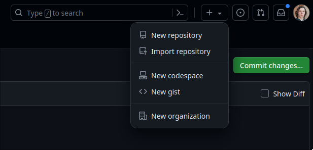
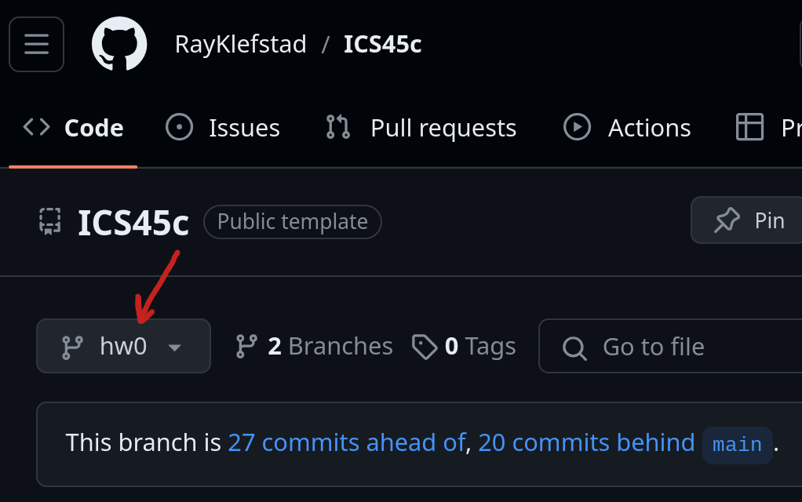

# ICS 45C

Welcome to the ICS 45C GitHub landing page! This GitHub repository contains the homework setup material you need for this course. This `main` branch helps you set up the GitHub connections you need, and introduces the tools we use in this course.

While following these instructions here in this `main` branch README, you will complete the following steps:

 1. On GitHub, create an account.
 2. On Openlab and GitHub, set up SSH keys for communicating between your Openlab and GitHub accounts.
 3. On Openlab, **clone** the public GitHub 45C course repository (`RayKlefstad/ICS45c`) to your Openlab.
 4. On GitHub, create your own private repository for this course on your own GitHub account.
 5. On Openlab, set up your private GitHub repository as a second `remote` so that you can `push` your work to it.

## 1 GitHub Account

GitHub is an online storage service for the tool `git`, an industry standard version control tool with many powerful capabilities. For this course, `git` allows you to
- easily obtain files needed for each Homework from the public ICS45c course repository,
- save your work in your own account on GitHub.com (in different versions/branches if you choose, so that you can try different approaches or changes without breaking what you were working on before), and
- easily upload your Homework submissions to GradeScope directly from GitHub.

This class **requires** the use of a GitHub account, so first create your account at  [GitHub.com](https://github.com/). If you already have a GitHub account, you can use your existing account for this course. Your GitHub account does not need to be linked to your UCI email.

## 2 Configure your `git` profile and add SSH keys

On Openlab, `git` is pre-installed, so now we will set up your basic `git` profile and add your GitHub `ssh-keys` to your account! SSH keys allow secure communication between your Openlab and your GitHub accounts, without the need to log in every time.

### Configure `git` profile

Log into Openlab, as you learned to do in [HW0.1](https://sites.google.com/view/45c-programming-in-cpp/homework-0-1-openlab). Once logged in to your Openlab terminal, you can now type commands to `git`. 

#### :warning: Where am I? 
>***When using a terminal, always be aware of your current working directory, and whether your current directory is your **local** machine (i.e., on the hard drive of your own computer) or remote, on Openlab. When following these instructions, make sure you are logged into Openlab!***

In your Openlab terminal, add your GitHub `username` and `email` by typing the following commands. The commands below shown as `<Example>` should be replaced with **your** information:

```bash
git config --global user.name "<YourGitHubNameHere>"    # Example: "Ray Klefstad"
git config --global user.email "<YourGitHubEmailHere>"  # Example: "klefstad@uci.edu"
```
### Set up an SSH key

Now set up an `ssh` key, because `GitHub` is moving away from allowing the usage of `https` links.  

First, generate an SSH key pair for GitHub on Openlab through the following steps:

- [ ] Type or copy the following command, using your GitHub email:
```shell
ssh-keygen -t ed25519 -C "<YourGitHubEmailHere>"
```
When you're prompted to `Enter a file in which to save the key`,  press **`Enter`** to accept the default file location.

- [ ] At the next prompt, you can enter a passphrase to protect your SSH key or simply hit **`Enter`** (twice) for no passphrase.
    
 ``` bash
$ Enter passphrase (empty for no passphrase): [Type a passphrase]
$ Enter same passphrase again: [Type passphrase again]
```

Now that you have created your SSH key on Openlab, add it to **your** `GitHub` account as follows:

- [ ] Copy the SSH public key to your clipboard:
     ```bash
      $ cat ~/.ssh/id_ed25519.pub
     ```
     Then select and copy the contents of the `id_ed25519.pub` file displayed in the terminal to your clipboard.
- [ ] On **your account** at GitHub.com, in the upper-right corner of any page, click your profile photo, then click **Settings**. <TODO: add pic>
- [ ] In the left sidebar menu, click  **SSH and GPG keys**.
- [ ] Click  **New SSH key**  or  **Add SSH key**.
- [ ] In the **Title** field, add the informative label `Openlab`.
- [ ] For the type of key, make sure **Authentication** is selected.
- [ ] In the **Key** field, paste your public key.
- [ ] Click  **Add SSH key**.

## 3 Clone this repository

Now that you have set up your `username`, `email`, and `ssh` key, [clone](https://docs.github.com/en/repositories/creating-and-managing-repositories/cloning-a-repository) this public ICS45c repository to your Openlab. On Openlab, you can clone a GitHub repository by using the command `git clone` and copy-pasting the **SSH link** you get when clicking the green `Code` button. Example below:


So run the following command:

```bash
git clone git@github.com:RayKlefstad/ICS45c.git
```
At the prompt `Are you sure you want to continue connecting (yes/no/[fingerprint])?` type `yes`.

This `git clone ...` command initializes a new git repository on your Openlab and populates it with the contents of the public `RayKlefstad/ICS45c` repository, adding the directory `ICS45c` to your current working directory, which you can see by typing the `ls` command.

The `git clone` command also establishes the public course repository at `RayKlefstad/ICS45c` as a `remote` connection called `origin`. `origin` is an alias (short nickname) for `git@github.com:RayKlefstad/ICS45c.git` so that you don't have to type that long connection path every time. You can then  `checkout` files from `origin`for all the future Homeworks (from the different branches named `hw0`, `hw1`...)---but **only after they are announced as available on Ed**!

## 4 Make your own private repository

Next, you need to be able to save your own work, but you **cannot save your own work in the public course repository**. Therefore, you need to create your own **private copy** of the public ICS45c repository, in your own GitHub account. 

To create your private copy , be sure you are in your own GitHub account, then click on the `+` in the top right of the GitHub page, and select `New repository` as shown below:



Give your GitHub repository a name such as `ICS45c`, and **make sure you set the visibility to private**!

⚠️ **Making your repository visibility public is a violation of academic integrity policy, allowing others to view and copy your code.** Be SURE at this stage that your repository visibility is private and remains so at all times, including after the course is over.

## 5 Set up private `remote` and `push`

Once created, set up your private GitHub repository as a second `remote` connection, so that you can `push` your work done on Openlab to it.  To do this, first copy the SSH clone link of your private repository from the green `Code` button just as you did earlier for the public course repository. Now go back to Openlab inside the directory `ICS45c` and run this command with the copy-pasted link:

```bash
git remote add my_repo <git@YourSSHLinkHere>
```

:warning: **Make sure that this link starts with `git@` and not with `https://` or it will not work!**

The command above establishes a second `remote` connection to your private repository on GitHub, and creates an alias (short nickname) `my_repo` so that you don't have to type that long connection link every time.

Your private repository should now be set up correctly! To verify that it works, you can use the command:

```bash
git push my_repo
```

This command pushes the current contents of your `ICS45c` folder, including the text you are reading right now, to your private GitHub repository. If this command finishes with no errors, and your private GitHub repository is no longer empty, then everything works! After you finish reading the rest of this page, you can move on to `Homework 0.2`.

## Tools

The following are a list of tools that will be used in this course. All of these tools have been set up for use on Openlab. Remember that we **WILL NOT** be able to support issues encountered if you use your personal setup, only the setup on Openlab.

- `git`
- `gcc`
- `make`
- `cmake`
- `valgrind`
- `gtest`

### `CMake`

For this course, we use `CMake`, an industry standard for building C/C++ projects. `CMake` in this course will consist of two files provided for each homework: `CMakePresets.json` and `CMakeLists.txt`. 
- `CMakePresets.json` describes to `CMake` the arguments, flags, and preferences that you want the compiler to use when building your project, as well as telling `CMake` where to put the files that it builds (which in this course will be the `build/` folder). 
- `CMakeLists.txt` describes the `.cpp` and `.hpp` files you intend to compile, where to find them, and how to package them into an executable `target`.

Learning about `CMake` is useful to you if you ever work with C/C++ code bases. For this class, we will provide simple `CMakeLists.txt` files with annotation to explain what each part is doing, but you will not be required to change it in any way. If you are interested in learning more about `CMake`, you can find more information at the official [CMake tutorial](https://cmake.org/cmake/help/latest/guide/tutorial/index.html).

### `GTest`

Testing your programs before submitting them is **essential** and will be **required** in several Homeworks to ensure your code behaves as you expect it to. GTest is an incredibly popular testing platform for `.cpp`, especially in large code bases, and is available on Openlab.  We will cover the basics of using `GTest` and adding your own tests in the required homeworks, but for more detailed information take a look at their [primer documentation](https://google.github.io/googletest/primer.html).

## Next steps: hw0

Next, at the upper left of this page, select the `hw0` branch, and follow the instructions in the README there.



To access instructions and files for all **future** Homeworks, use that same branch drop down menu at the top of this page (the public ICS45c GitHub) to select the Homework you wish to work on, **but ONLY AFTER they are announced as available on Ed**.Then follow the instructions on the README for that homework branch.

**:warning: DO NOT checkout anything from the public GitHub `ICS45c` repository until its availability is announced on Ed! You may obtain out-of-date files and instructions which will confuse you, waste time, and require more advanced and complex `git` operations to undo!**
